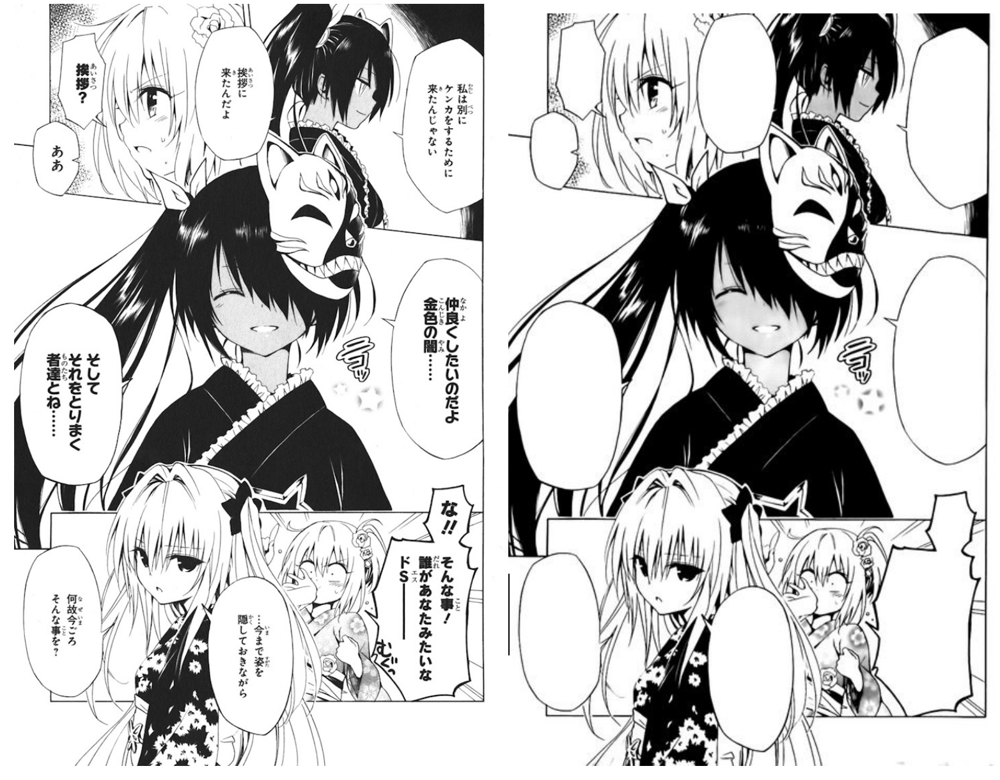
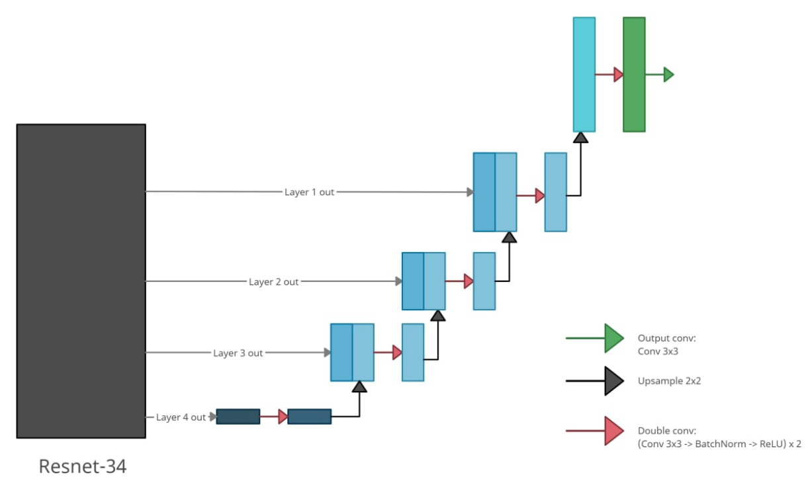

# Auto manga cleaner

## Description
Automating cleaning of manga. 

Manga cleaning, that is, removal of all original text, is a repetitive and laborious task, yet it is necessary to carry out manga translation. We aim to automate most of it with neural networks.

Ideally, we want to produce a user-friendly tool that can automatically identify and remove all text from the panels, like in this picture:

## Dataset
We are currently using pictures from [Manga109](http://www.manga109.org/en/) dataset, though we are also thinking of making our own dataset.

## Model

Currently, we are experimenting with a combination of a pretrained resnet34 + Unet model (borrowed from the paper "[Unconstrained Text Detection in Manga](https://arxiv.org/abs/2009.04042)")

## Team
* Dinislam Gabitov.
* Vyacheslav Sergeev.
* Nikita Strygin
