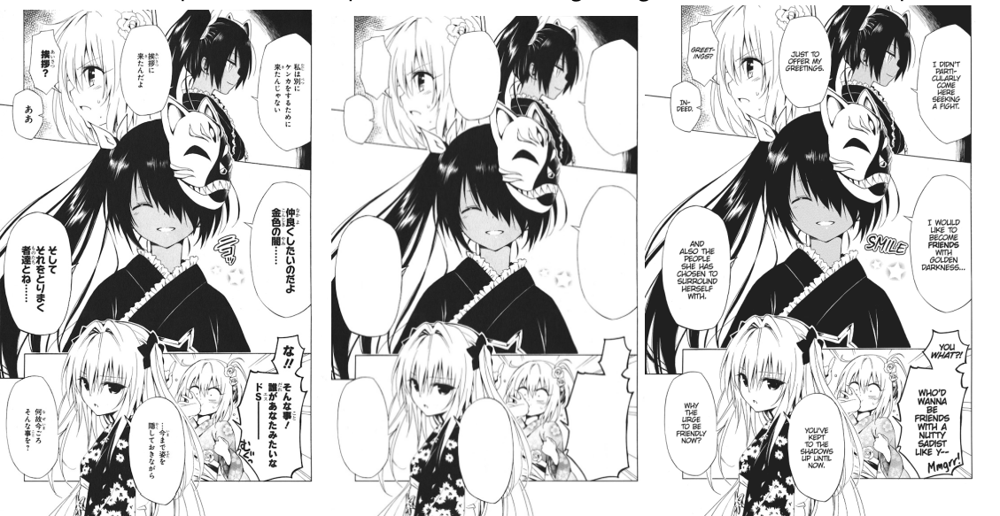

# Auto manga cleaner
## Team
* Dinislam Gabitov.
* Vyacheslav Sergeev.
* Nikita Strygin

## Description
Nowadays japanese manga has become a very prominent
form of entertainment with up to 70% of comics being sold
in some European countries being manga. However with
this popularity came the challenge of accessibility. Since
overwhelming majority of manga is produced in Japan the
European readers have to seek the translated versions. Since
the number of manga importers is still pretty limited unofficial
translations of manga have become commonplace and are used
by a large portion of manga readers.
\
\
The challenge of translating the manga can easily be underestimated. The most important thing to keep in mind is
that not only the translator has to translate the japanese text
to english, which is somewhat easy, but also to insert the text
back Into the manga. This presents an unusual challenge since
unofficial translators of manga have to first scan the manga and
then remove all of the text in the scanned images by hand, then
reinsert the text back into the image and make it look like a
part of the original manga.

## Dataset
The data is one of the bigger challenges in this project.
We have decided to utilize [Manga109](http://www.manga109.org/en/) dataset. It provides
access to some of the copyrighted manga with text annotations,
but can be used only for research purposes.

## Model
We have conducted small literature review and have identified that current state-of-the-art is a combination of a pretrained resnet34 + Unet model.

