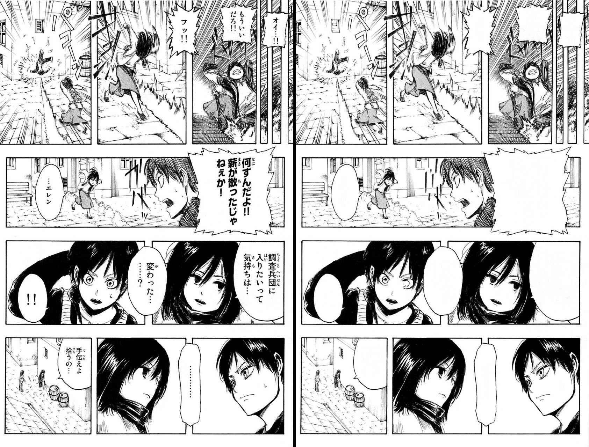
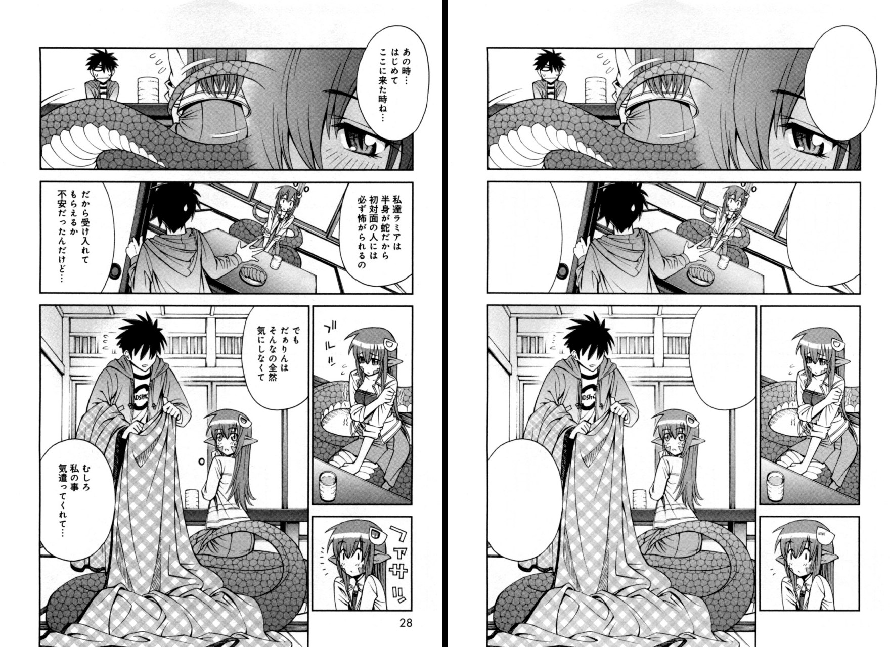
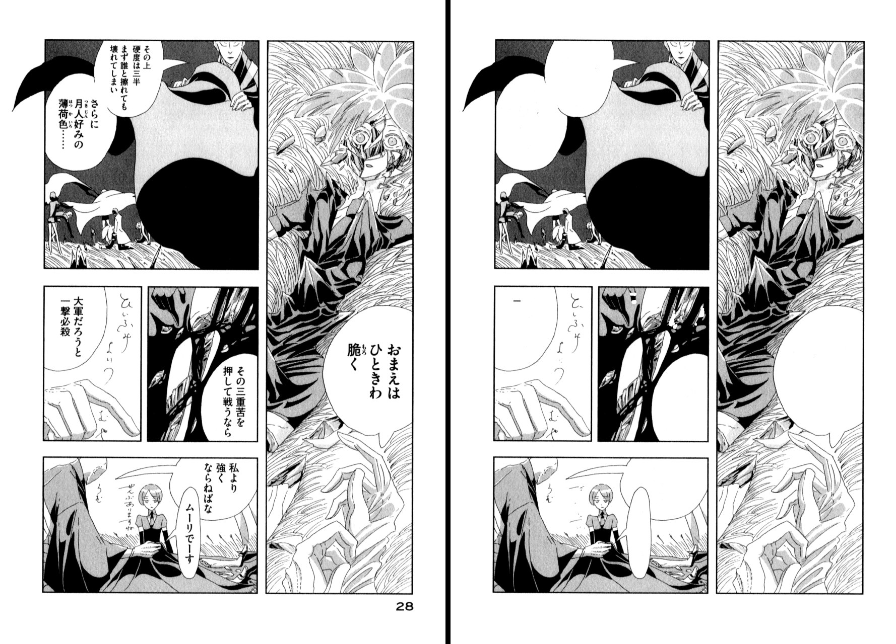

# Auto manga cleaner

## Description
Automating cleaning of manga. 

Manga cleaning, that is, removal of all original text, is a repetitive and laborious task, yet it is necessary to carry out manga translation. We aim to automate most of it with neural networks.

Ideally, we want to produce a user-friendly tool that can automatically identify and remove all text from the panels, like in this picture:

## Dataset
We are currently using pictures from [Manga109](http://www.manga109.org/en/) dataset, though we are also thinking of making our own dataset.

## Model

Currently, we are experimenting with a combination of a pretrained resnet34 + Unet model (borrowed from the paper "[Unconstrained Text Detection in Manga](https://arxiv.org/abs/2009.04042)")

## Usage

This tool is a available as an Adobe Photoshop CC 2022 plugin (windows only for now)

To try it out:

1. Download `mangai_clean.8bf` file from [Releases](https://github.com/Dinislam36/Auto_manga_cleaner/releases)
2. Copy it to Photoshop's Plug-ins folder (With default installation it's in `C:\Program Files\Adobe\Adobe Photoshop 2022\Plug-ins`)
3. Use the plugin from `Filters > MangAI > Clean Manga Page...` menu

Note that it only works with RGB8 and GrayScale8 images for now.

## Example Results

## Team
* Dinislam Gabitov.
* Vyacheslav Sergeev.
* Nikita Strygin
